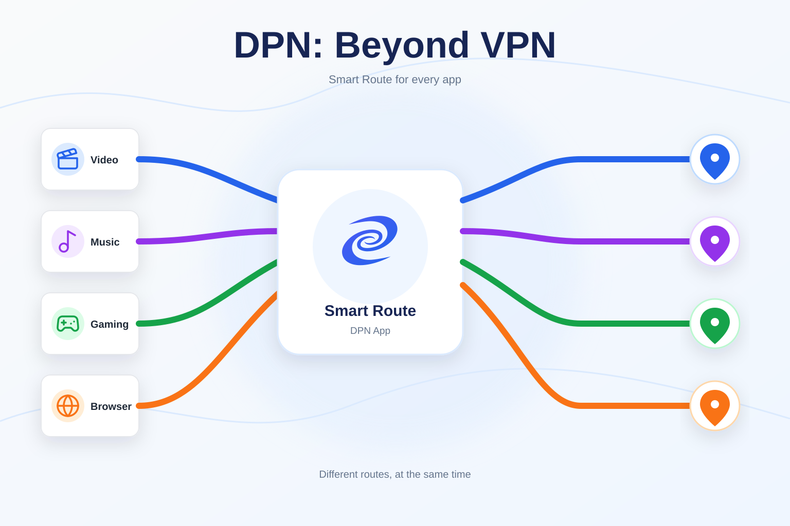
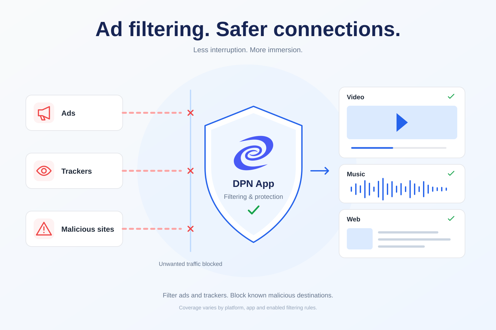
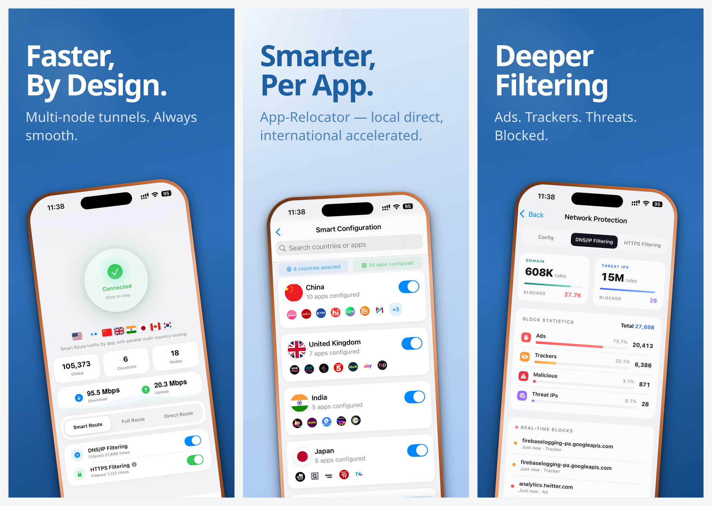

# DPN: Beyond VPN

**DPN** is a privacy-oriented app from [Deeper Network](https://www.deeper.network/) that combines app-aware routing, selectable encrypted tunnels, and network-level filtering in one device-level application.

[Download DPN](https://dpn.deeper.network/download) | [How DPN Works](https://dpn.deeper.network/how-dpn-works) | [FAQ](https://dpn.deeper.network/faq)

> **7-day free trial code:** `ZJXYY8NB`

## Why DPN

Traditional full-tunnel VPNs send included traffic through a single exit. DPN gives you more control over how individual apps and connections are routed.

- **App Relocator** assigns supported apps to selected country tunnels while other traffic can stay direct.
- **Multi-tunnel Smart Route** keeps multiple selected tunnels available so supported apps can use different routes at the same time.
- **Flexible routing modes** let you choose between app-aware routing, a single full tunnel, or a direct connection.
- **Deeper Filtering Engine** applies DNS/IP rules across supported traffic, with optional HTTPS filtering where the platform supports it.

## Routing Modes

| Mode | How it works |
| --- | --- |
| **Smart Route** | Applies app-aware rules so supported apps can use assigned tunnels while other traffic stays direct or follows another available route. |
| **Full Route** | Sends traffic through one selected exit route. |
| **Direct Route** | Keeps ordinary traffic direct while retaining supported filtering controls. |

## Supported Platforms

| Platform | Distribution |
| --- | --- |
| Windows | 64-bit installer |
| macOS | Apple Silicon and Intel installers |
| Linux | 64-bit Debian package |
| Android | APK |
| iOS | [Apple App Store](https://apps.apple.com/us/app/dpn-beyond-vpn/id6748636811) |

Visit the [official download page](https://dpn.deeper.network/download) for the versions currently available for your device. Installers published through this repository are attached to the [GitHub Releases](https://github.com/DeeperNetwork/dpn-app/releases) page.

## Filtering Notes

Routing and filtering are separate controls. DNS/IP filtering applies configured domain and IP rules before supported connections are made. HTTPS filtering requires the Deeper Network root certificate, and its coverage depends on the operating system. On Android, HTTPS filtering applies in supported web browsers and does not apply inside other apps.

With the right filtering rules enabled, supported traffic can also avoid many common advertising and tracking endpoints. Depending on the platform and the app's connection paths, this may help reduce interruptions in services such as the YouTube iOS app and Spotify, while results can vary as those services change their delivery infrastructure.

## Inside the App

Explore the home dashboard, per-app routing, and network protection in these iOS App Store previews. Interface and available controls vary by platform and version.

## DPN and Deeper Connect

DPN is an official Deeper Network software product that runs directly on an individual device. It does not require Deeper Connect hardware. Deeper Connect is a separate product designed for network-level deployment.

## Official Resources

- [DPN Download](https://dpn.deeper.network/download)
- [How DPN Works](https://dpn.deeper.network/how-dpn-works)
- [Frequently Asked Questions](https://dpn.deeper.network/faq)
- [Privacy Policy](https://dpn.deeper.network/privacy-policy)
- [Terms of Use](https://dpn.deeper.network/terms-of-use)
- [Deeper Network](https://www.deeper.network/)

## About This Repository

This repository is the public distribution home for DPN release packages and release notes. It does not contain the DPN source code. Use of DPN is subject to the [Terms of Use](https://dpn.deeper.network/terms-of-use).
