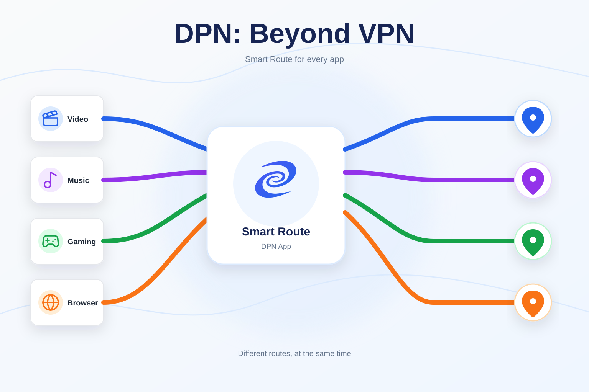
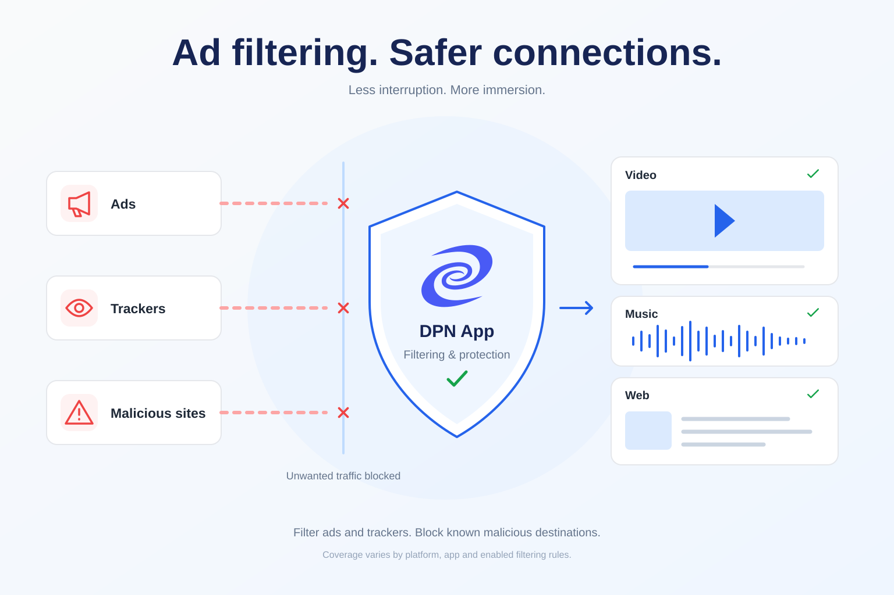
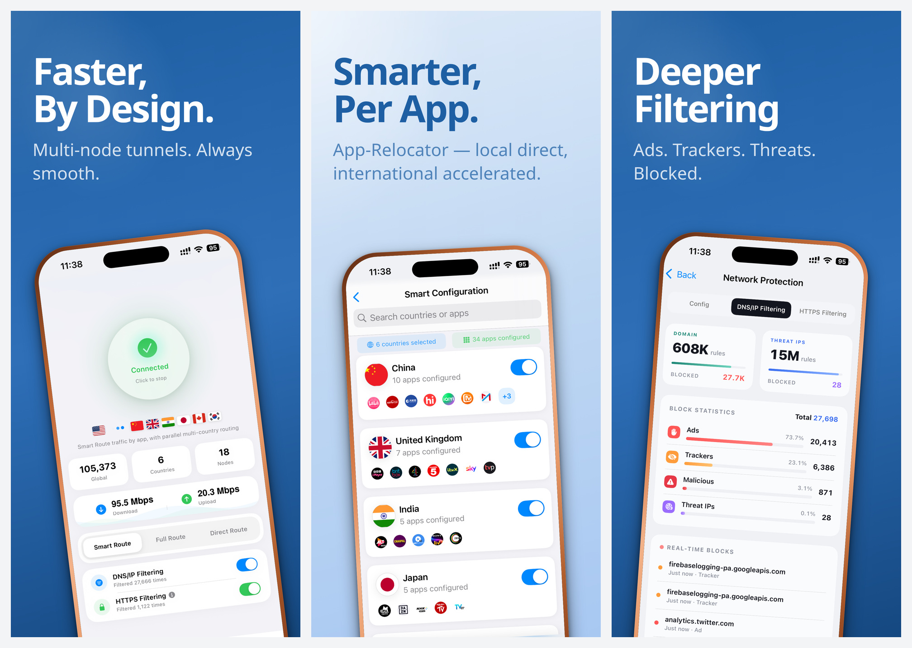

# DPN: Beyond VPN

[English](README.md) | **Русский**

**DPN** — приложение от [Deeper Network](https://www.deeper.network/) для защиты конфиденциальности. Оно объединяет маршрутизацию для отдельных приложений, выбор зашифрованных туннелей и фильтрацию сетевого трафика.

[Зеркало загрузки на GitHub](https://github.com/tiger-zsh/dpn-app/releases/latest) | [Официальная страница загрузки](https://dpn.deeper.network/download) | [Как работает DPN](https://dpn.deeper.network/how-dpn-works) | [Частые вопросы](https://dpn.deeper.network/faq)

> **Код для бесплатного пробного периода на 7 дней:** `ZJXYY8NB`

## Скачать DPN

Откройте [последний зеркальный релиз на GitHub](https://github.com/tiger-zsh/dpn-app/releases/latest) и выберите установочный файл в разделе **Assets**. Предыдущие версии доступны в [списке зеркальных релизов](https://github.com/tiger-zsh/dpn-app/releases). Оригинальные установочные файлы также доступны на [официальной странице загрузки](https://dpn.deeper.network/download).

Зеркало загрузки на GitHub поддерживает [tiger-zsh](https://github.com/tiger-zsh/dpn-app), отдельно от [официального репозитория](https://github.com/DeeperNetwork/dpn-app). Оно содержит копии официальных установочных файлов без изменений, но не является официальным каналом релизов Deeper Network.

| Платформа | Архитектура | Установочный файл |
| --- | --- | --- |
| Windows | x86-64 | `DPN-<version>-windows-x86-64.exe` |
| macOS | Apple Silicon (серия M) | `DPN-<version>-macos-arm-64.dmg` |
| macOS | Intel | `DPN-<version>-macos-x86-64.dmg` |
| Linux | x86-64, Debian/Ubuntu | `DPN-<version>-linux-x86-64.deb` |
| Android | Официальный APK | `DPN-<version>-android-x64.apk` |
| iOS | iPhone/iPad | [Apple App Store](https://apps.apple.com/us/app/dpn-beyond-vpn/id6748636811) |

Версии для разных платформ могут отличаться. Имя файла Android сохранено в исходном виде и само по себе не определяет поддерживаемые архитектуры процессора. Для iOS приложение распространяется через App Store; установочного файла для GitHub нет.

### Проверка загрузки

Каждый зеркальный релиз содержит `SHA256SUMS.txt` и `download-manifest.json` с исходными ссылками, версиями, размерами файлов и контрольными суммами SHA-256. Установочные файлы копируются без изменений и повторной подписи. Контрольная сумма помогает обнаружить повреждение или изменение файла, но не заменяет независимую подпись разработчика.

Скачайте `SHA256SUMS.txt` вместе с нужным установочным файлом. В macOS выполните `shasum -a 256 <имя-файла>`, в Linux — `sha256sum <имя-файла>`, в Windows PowerShell — `Get-FileHash .\<имя-файла> -Algorithm SHA256`. Сравните результат со строкой для вашего файла в `SHA256SUMS.txt`.

## Почему DPN

Обычный VPN с полным туннелированием направляет весь включённый трафик через одну точку выхода. DPN позволяет отдельно управлять маршрутами приложений и соединений.

- **App Relocator** назначает поддерживаемым приложениям туннели выбранных стран, пока остальной трафик может идти напрямую.
- **Многотуннельная маршрутизация Smart Route** поддерживает несколько выбранных туннелей одновременно, чтобы приложения могли использовать разные маршруты.
- **Режимы маршрутизации** позволяют выбирать маршрутизацию по приложениям, единый полный туннель или прямое соединение.
- **Deeper Filtering Engine** применяет правила DNS/IP к поддерживаемому трафику. Дополнительная HTTPS-фильтрация доступна на поддерживаемых платформах.

## Режимы маршрутизации

| Режим | Как работает |
| --- | --- |
| **Smart Route** | Применяет правила для отдельных приложений: поддерживаемые приложения используют назначенные туннели, а остальной трафик идёт напрямую или по другому доступному маршруту. |
| **Full Route** | Направляет трафик через один выбранный маршрут выхода. |
| **Direct Route** | Оставляет обычный трафик на прямом соединении, сохраняя поддерживаемые средства фильтрации. |

## Особенности фильтрации

Маршрутизация и фильтрация настраиваются отдельно. DNS/IP-фильтрация применяет правила для доменов и IP-адресов до установления поддерживаемых соединений. Для HTTPS-фильтрации требуется корневой сертификат Deeper Network; её охват зависит от операционной системы. На Android HTTPS-фильтрация работает в поддерживаемых веб-браузерах, но не внутри других приложений.

При включённых правилах фильтрации поддерживаемый трафик может обходить многие распространённые рекламные и отслеживающие узлы. В зависимости от платформы и способа подключения приложения это может уменьшить количество рекламных прерываний, в том числе в YouTube для iOS и Spotify. Результаты могут меняться вместе с инфраструктурой этих сервисов.

## Интерфейс приложения

На изображениях из App Store показаны главный экран, маршрутизация по приложениям и сетевая защита. Интерфейс и доступные функции зависят от платформы и версии. Язык этой страницы не определяет язык интерфейса приложения.

## DPN и Deeper Connect

DPN — официальный программный продукт Deeper Network, работающий непосредственно на отдельном устройстве. Оборудование Deeper Connect для него не требуется. Deeper Connect — отдельный продукт для развёртывания на уровне сети.

## Официальные ресурсы

- [Загрузка DPN](https://dpn.deeper.network/download)
- [Как работает DPN](https://dpn.deeper.network/how-dpn-works)
- [Частые вопросы](https://dpn.deeper.network/faq)
- [Политика конфиденциальности](https://dpn.deeper.network/privacy-policy)
- [Условия использования](https://dpn.deeper.network/terms-of-use)
- [Deeper Network](https://www.deeper.network/)

## Об этом репозитории

Этот репозиторий предназначен для публикации установочных файлов DPN и заметок к релизам. Исходный код DPN здесь не размещается. Использование DPN регулируется [условиями использования](https://dpn.deeper.network/terms-of-use).
